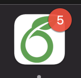
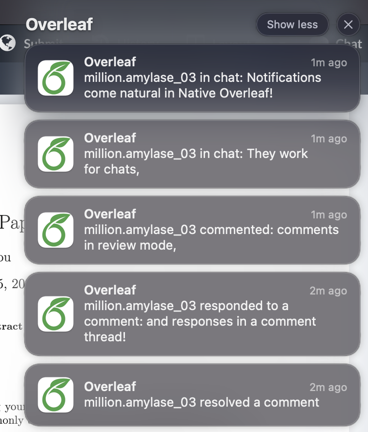
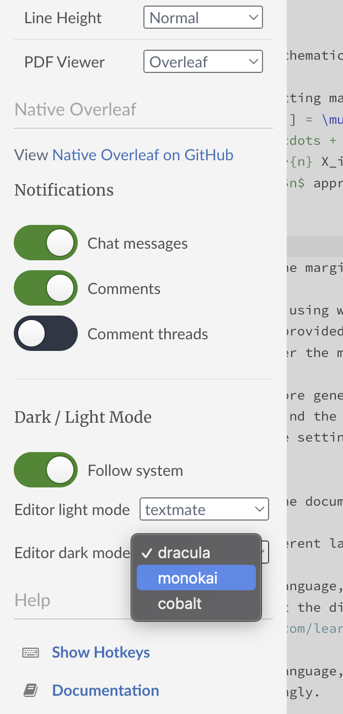
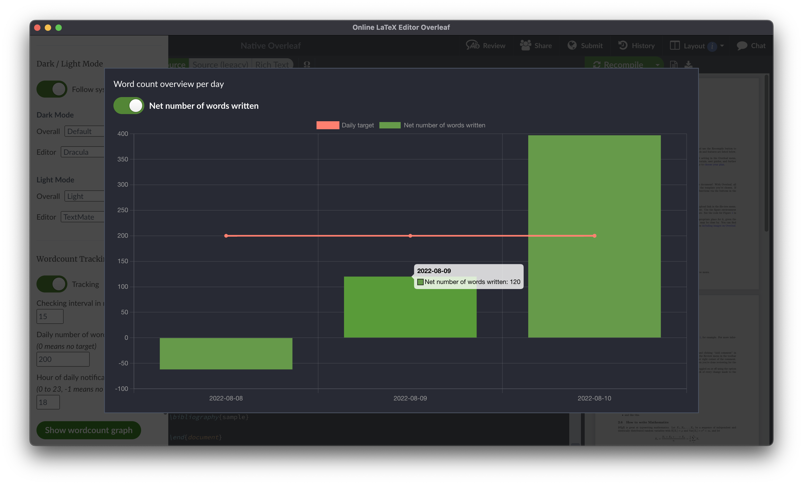

# Native Overleaf
Overleaf is a fantastic webtool for writing and cooperating on LaTeX documents. 
However, would it not be even better if it were to behave like a native app on your system? 

[Download directly for your system below](#download-binary)!

## Contents
- [Contents](#contents)
- [Features](#features)
- [Next Features](#next-features)
- [Tips](#tips)
- [How it works](#how-it-works)
- [Download binary](#download-binary)
  - [**Mac**](#mac)
  - [**Linux**](#linux)
  - [**Windows**](#windows)
- [Troubleshooting](#troubleshooting)
  - [Institutional login](#institutional-login)
  - [Unable to open on Mac](#unable-to-open-on-mac)
  - [Wordcounts & projects](#wordcounts--projects)
- [Compile your own](#compile-your-own)
- [Ideas, questions, contributions?](#ideas-questions-contributions)

## Features
- [x] standalone native application
- [x] system-based dark / light mode switching 
- [x] notifications of chats, comments and comment threads
- [x] preferences pane integrated in the Overleaf sidemenu
- [x] automatic update checking
- [x] words-per-day tracker, reminder & graph (useful for the 200-words-per-day-doctrine)

    
    
    
    
    

## Next Features
- [ ] automated local backups of projects (planned for future version)
- [ ] notifications for tracked changes (planned for future version)
- [ ] integrate Writeful for Overleaf extension (future version if technically possible) <!-- not supported but possible: https://github.com/nativefier/nativefier/issues/1433 Electron supports this: https://www.electronjs.org/docs/latest/api/extensions -->

[Looking to contribute?](#ideas-questions-contributions)

## Tips
- The preferences pane can be found in the same left-side menu as the other Overleaf settings. 
- You can run multiple instances of Native Overleaf, allowing you to keep multiple projects open at the same time and receive notifications for each project. 
- The word count tracker tracks the total words in the project, so includes anything written by other authors. It counts the words in the compiled PDF, hence it must be recompiled to reflect recent changes. 
- Notice on notifications: For notifications to work, the app must be allowed to by your system. You will only receive notifications for projects that are opened in the background, so you will not get notifications while working in a project. **Important**: to get notifications for chats, the chat window must have been opened at least once after loading a project (you can close it again). This is a limitation of the way we listen for new chat messages. If someone has a better idea, please get in touch. 

## How it works
Using [nativefier](https://github.com/nativefier/nativefier), the Overleaf website is wrapped as an Electron app and injected with JavaScript. While this is not optimally efficient and we may switch to a more efficient framework in the future, it does allow combining the webapp with native feature with a large number of supported platforms. <!-- may switch to [Multi](https://github.com/kofigumbs/multi#purchasing) in the future -->

## Download binary
If there is interest in this project, I will add it to Homebrew for easy updates. 
Should you have any problems running the app, please [comment on or open an issue](https://github.com/fjwillemsen/NativeOverleaf/issues)!
For now, the following binaries have been precompiled and can be downloaded directly:

### **Mac**
* [Apple Silicon (M1/M2)](https://github.com/fjwillemsen/NativeOverleaf/releases/latest/download/Overleaf-darwin-arm64.zip)
* [Intel (64-bit only)](https://github.com/fjwillemsen/NativeOverleaf/releases/latest/download/Overleaf-darwin-x64.zip)

### **Linux**
* [ARM64 (64-bit)](https://github.com/fjwillemsen/NativeOverleaf/releases/latest/download/Overleaf-linux-arm64.zip)
* [ARMv7L (32-bit)](https://github.com/fjwillemsen/NativeOverleaf/releases/latest/download/Overleaf-linux-armv7l.zip)
* [X64 (64-bit)](https://github.com/fjwillemsen/NativeOverleaf/releases/latest/download/Overleaf-linux-x64.zip)

### **Windows**
* [ARM64 (64-bit)](https://github.com/fjwillemsen/NativeOverleaf/releases/latest/download/Overleaf-win32-arm64.zip)
* [X86 (64-bit)](https://github.com/fjwillemsen/NativeOverleaf/releases/latest/download/Overleaf-win32-x64.zip)

If your platform / architecture is missing, let me know via the [discussions page](https://github.com/fjwillemsen/NativeOverleaf/discussions), or compile it yourself using the instructions below. 

## Troubleshooting
If you have any problem running the app not fixed with these instructions, please [comment on or open an issue](https://github.com/fjwillemsen/NativeOverleaf/issues)!

### Institutional login
This has been fixed in v1.4.0. If you encounter a related issue, look at [issue #3](https://github.com/fjwillemsen/NativeOverleaf/issues/3) or open a new issue. 

### Unable to open on Mac
If you get the message that "Apple can't verify this app doesn't contain malware", use right-click -> open to open it. 
If you get "This app is damaged and can't be opened", download the archive again and unzip it using Finder's built-in Archive Utility or [ditto](https://ss64.com/osx/ditto.html) (otherwise codesigning metadata may be lost). 

### Wordcounts & projects
Currently, the wordcount tracking settings are globally. 
In the future we can change this to per-project settings. 
If you want this, please [create an issue](https://github.com/fjwillemsen/NativeOverleaf/issues/new). 

## Compile your own
Want to adjust some settings or just build from scratch for your device? Easily create your own native version of Overleaf!
In just four easy steps you can compile Overleaf as a native app for your device.  

- Step 1: open your terminal and `cd` to wherever you want to install Overleaf. 
- Step 2: download this repository (e.g. `git clone https://github.com/fjwillemsen/NativeOverleaf.git`).
- Step 3: install the package.json dependencies, and optionally the devDependencies if you want to change the JavaScript code. 
- Step 4: use the `compile-all.sh` script (without codesigning) for inspiration, executing and modifying the commands as needed. Alternatively (not recommended), run `nativefier 'https://overleaf.com' --name 'Overleaf' --app-version <latest version> --darwin-dark-mode-support --inject bundled_script.js --icon Icon/<select icon>`. If you have an Apple Silicon (M1/M2) Mac, be sure to add `--arch arm64` as Homebrew may still be an Intel process in some cases. If you do not intend to distribute the app, leave out the codesigning, otherwise create your own self-signed certificate. 

After being built, the app appears in the folder - you can copy it to another location if desired. 

## Ideas, questions, contributions?
Please use the [GitHub discussions page](https://github.com/fjwillemsen/NativeOverleaf/discussions) for this project. This allows others to read and chime in as well. 
If you'd like to contribute, great! 
Feel free to submit pull requests via forks. 
